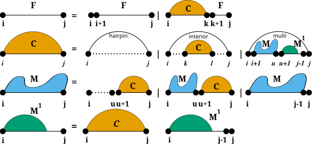

The RNA Folding Grammar
=======================

The RNA folding grammar as implemented in RNAlib

.. toctree::
   :maxdepth: 1
   :caption: Specialized Modules:

   grammar/model_details
   grammar/constraints
   grammar/domains_up
   grammar/domains_struc

Introduction
------------

To predict secondary structures composed of the four distinguished loop types
introduced before, all algorithms implemented in *RNAlib* follow a specific
recursive decomposition scheme, also known as the *RNA folding grammar*, or
*Secondary Structure Folding Recurrences*.

However, compared to other RNA secondary structure prediction libraries, our
implementation allows for a fine-grained control of the above recursions through:

* :doc:`/grammar/constraints`, that may be applied to both, the individual
  derivations of the grammar (:doc:`/grammar/constraints/hard`) as well as
  the evaluation of particular loop contributions (:doc:`/grammar/constraints/soft`)

* **Extension of the RNA folding grammar rule set**. Here, users may provide
  additional rules for each of the decomposition stages ``F``, ``C``, ``M``,
  and ``M1``, as well further auxiliary rules.

* :doc:`/grammar/domains_struc` and :doc:`grammar/domains_up` that already implement
  efficient grammar extensions for self-enclosed structures and unpaired sequence
  segments, respectively.

Additional Structural Domains
-----------------------------

Some applications of RNA secondary structure prediction require an extension
of the *regular RNA folding grammar*. For instance one would like to include
proteins and other ligands binding to unpaired loop regions while competing
with conventional base pairing. Another application could be that one may
want to include the formation of self-enclosed structural modules, such as
*G-quadruplexes*. For such applications, we provide a pair of additional domains
that extend the regular RNA folding grammar, :doc:`/grammar/domains_struc` and
:doc:`grammar/domains_up`.

.. image:: gfx/GCrecursion.png

While unstructured domains are usually determined by a more or less precise
sequence motif, e.g. the binding site for a protein, structured domains are
considered self-enclosed modules with a more or less complex pairing pattern.
Our extension with these two domains introduces two production rules to fill
additional dynamic processing matrices ``S`` and ``U`` where we store the
pre-computed contributions of structured domains (``S``), and unstructured
domains (``U``).

Extending the RNA Folding Grammar
---------------------------------

The RNA folding grammar can be easily extended by additional user-provided
rules. For that purpose, we implement a generic callback-based machinery, that
allows one to add rules to the existing decomposition stages ``F``, ``C``, ``M``,
and ``M1``. If such an extension is not sufficient, users may even extend the
grammar by arbitrary additional derivations.

Additional rules can be supplied for both, MFE and partition function computations.
Here, a set of two callback functions must be provided, one for the *inside*, and
another for the *outside* recursions. The functions will then be called at appropriate
steps in the recursions automatically. Each function will be provided with a
set of parameters for the decomposition step and a user-defined data pointer that
may point to some memory storing any additional data required for the grammar rule.

The detailed API for this mechanism can be found below.

RNA Folding Grammar Extension API
---------------------------------

.. doxygengroup:: grammar
    :no-title:
