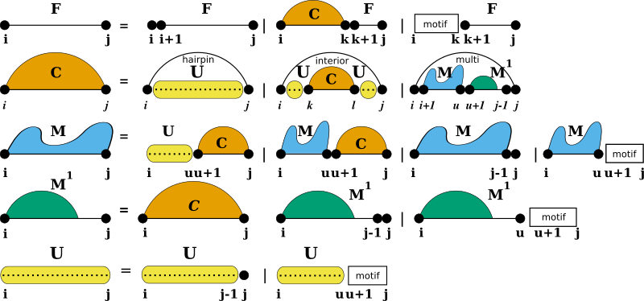

Unstructured Domains
====================

Add and modify unstructured domains to the RNA folding grammar.

.. contents:: Table of Contents
    :local:
    :depth: 2

Introduction
------------

Unstructured domains appear in the production rules of the RNA folding grammar
wherever new unpaired nucleotides are attached to a growing substructure
(see also :cite:t:`lorenz:2016b`):

The white boxes represent the stretch of RNA bound to the ligand and represented by a more or less specific
sequence motif. The motif itself is considered unable to form base pairs. The additional production rule ``U``
is used to precompute the contribution of unpaired stretches possibly bound by one or more ligands. The
auxiliary DP matrix for this production rule is filled right before processing the other (regular) production
rules of the RNA folding grammar.

Description
-----------

This module provides the tools to add and modify unstructured domains to the production rules of the RNA folding grammar.
Usually this functionality is utilized for incorporating ligand binding to unpaired stretches of an RNA.

.. warning::

  Although the additional production rule(s) for unstructured domains as descibed in :ref:`grammar:unstructured domains`
  are always treated as *segments possibly bound to one or more ligands*, the current implementation requires
  that at least one ligand is bound. The default implementation already takes care of the required changes,
  however, upon using callback functions other than the default ones, one has to take care of this fact.
  Please also note, that this behavior might change in one of the next releases, such that the decomposition
  schemes as shown above comply with the actual implementation.

A default implementation allows one to readily use this feature by simply adding sequence motifs and corresponding
binding free energies with the function :c:func:`vrna_ud_add_motif()` (see also :doc:`/ligands/unstructured_domains`).

The grammar extension is realized using a callback function that

* evaluates the binding free energy of a ligand to its target sequence segment (white boxes in the figures above), or
* returns the free energy of an unpaired stretch possibly bound by a ligand, stored in the additional ``U`` DP matrix.

The callback is passed the segment positions, the loop context, and which of the two above mentioned
evaluations are required. A second callback implements the pre-processing step that
prepares the ``U`` DP matrix by evaluating all possible cases of the additional production rule.
Both callbacks have a default implementation in *RNAlib*, but may be over-written by a
user-implementation, making it fully user-customizable.

For equilibrium probability computations, two additional callbacks exist. One to store/add and one to retrieve the
probability of unstructured domains at particular positions. Our implementation already takes care of computing
the probabilities, but users of the unstructured domain feature are required to provide a mechanism to efficiently
store/add the corresponding values into some external data structure.

Unstructured Domain API
-----------------------

For the sake of flexibility, each of the domains is associated with a specific
data structure serving as an abstract interface to the extension. The interface
uses callback functions to

  * pre-compute arbitrary data, e.g. filling up additional dynamic programming matrices, and
  * evaluate the contribution of a paired or unpaired structural feature of the RNA.

Implementations of these callbacks are separate for regular free energy evaluation,
e.g. MFE prediction, and partition function applications. A data structure holding
arbitrary data required for the callback functions can be associated to the domain
as well. While *RNAlib* comes with a default implementation for structured and
unstructured domains, the system is entirely user-customizable.

.. admonition:: See also...

  :doc:`/grammar/domains_up`, :doc:`/grammar/domains_struc`, :doc:`/modules/gquads`,
  :doc:`/ligands/unstructured_domains`

.. doxygengroup:: domains_up
    :no-title:

