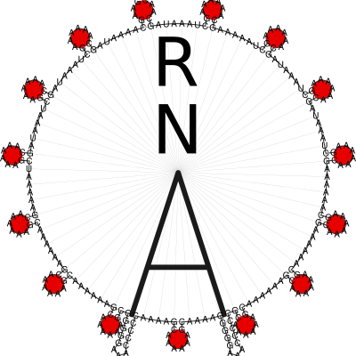

.. RNA documentation master file, created by
   sphinx-quickstart on Thu Jul 28 23:52:58 2022.
   You can adapt this file completely to your liking, but it should at least
   contain the root `toctree` directive.

A Library for predicting and comparing RNA secondary structures
---------------------------------------------------------------

The core of the **ViennaRNA Package** (:cite:t:`lorenz:2011,hofacker:1994`)
is formed by a collection of routines for the prediction and comparison
of RNA secondary structures. These routines can be accessed through
stand-alone programs, such as *RNAfold*, *RNAdistance* etc., which should
be sufficient for most users. For those who wish to develop their own
programs we provide *RNAlib*, a C-library that can be linked to your own
code or even used in your scripts and pipelines through our :doc:`/wrappers`
for :doc:`Python <api_python>` and Perl 5.

This document describes the library and will be primarily useful to
programmers. However, it also contains details about the implementation
that may be of interest to advanced users. The stand-alone programs are
described in separate man pages.

The latest version of the package including source code and html
versions of the documentation can be found at
https://www.tbi.univie.ac.at/RNA and https://github.com/ViennaRNA/ViennaRNA.

.. toctree::
   :caption: Installation
   :maxdepth: 1

   install
   configuration

.. toctree::
   :caption: Usage:
   :maxdepth: 1

   getting_started
   io
   examples

.. toctree::
   :caption: RNAlib
   :maxdepth: 1

   api
   wrappers
   api_python
   linking

.. toctree::
   :caption: Miscellaneous
   :maxdepth: 1

   News <news>
   changelog
   bibliography
   faq
   Contributing <contributing>
   license

Indices and tables
------------------

* :ref:`genindex`
* :ref:`modindex`
* :ref:`search`

Contributors
------------

Over the past decades since the ViennaRNA Package first sprang to life as part
of Ivo L. Hofackers PhD project, several authors contributed more and more
algorithm implementations. In 2008, Ronny Lorenz took over the extensive task
to harmonize and simplify the already existing implementations for the sake
of easier feature addition. This eventually lead to version 2.0 of the ViennaRNA
Package. Since then, he (re-)implemented a large portion of the currently existing
library features, such as the new, generalized constraints framework, RNA folding
grammar domain extensions, and the major part of the scripting language interface.

Below is a list of most people who contributed larger parts of the implementations:

* Daniel Wiegreffe (RNAturtle and RNApuzzler secondary structure layouts)
* Andreas Gruber (first approach on RNALfold Z-score filtering)
* Juraj Michalik (non-redundant Boltzmann sampling)
* Gregor Entzian (neighbor, walk)
* Mario Koestl (worked on SWIG interface and related unit testing)
* Dominik Luntzer (pertubation fold)
* Stefan Badelt (cofold evaluation, RNAdesign.pl, cofold findpath extensions)
* Stefan Hammer (parts of SWIG interface and corresponding unit tests)
* Ronny Lorenz (circfold, version 2.0, generic constraints, grammar extensions, and much more)
* Hakim Tafer (RNAplex, RNAsnoop)
* Ulrike Mueckstein (RNAup)
* Stephan Bernhart (RNAcofold, RNAplfold, unpaired probabilities, alifold, and so many more)
* Stefan Wuchty (RNAsubopt)
* Ivo Hofacker, Peter Stadler, and Christoph Flamm (almost every implementation up to version 1.8.5)

We also want to thank the following people:

* Sebastian Bonhoeffer's implementation of partition function folding served as a precursor to our part_func.c
* Manfred Tacker hacked constrained folding into fold.c for the first time
* Martin Fekete made the first attempts at "alignment folding"
* Andrea Tanzer and Martin Raden (Mann) for not stopping to report bugs found through comprehensive usage of our applications and RNAlib

Thanks also to everyone else who helped testing and finding bugs, especially
Christoph Flamm, Martijn Huynen, Baerbel Krakhofer, and many more.

