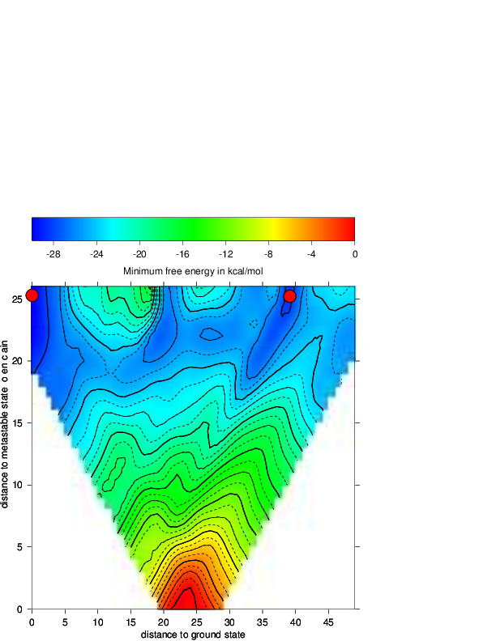
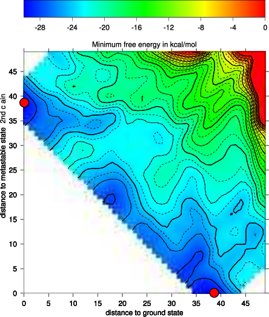

=========================
The Program ``RNA2Dfold``
=========================

.. contents:: Table of Contents
    :depth: 1
    :local:

``RNA2Dfold`` is a tool for computing the MFE structure, partition function and
representative sample structures of :math:`\kappa, \lambda` neighborhoods
and projects an high dimensional energy landscape of RNA into two dimensions :cite:p:`lorenz:2009`.
Therefore a sequence and two user-defined reference structures are expected by
the program. For each of the resulting distance class, the MFE representative,
the Boltzmann probabilities and the Gibbs free energy is computed. Additionally, 
representative suboptimal secondary structures from each partition can be
calculated. 

.. code::

  $ RNA2Dfold -p < 2dfold.inp > 2dfold.out

The outputfile ``2dfold.out`` should look like below, check it out, e.g. using
``less``::

  CGUCAGCUGGGAUGCCAGCCUGCCCCGAAAGGGGCUUGGCGUUUUGGUUGUUGAUUCAACGAUCAC
  ((((((((((....)))))..(((((....))))).)))))...(((((((((...))))))))). (-30.40)
  ((((((((((....)))))..(((((....))))).)))))...(((((((((...))))))))). (-30.40) <ref 1>
  .................................................................. (  0.00) <ref 2>
  free energy of ensemble = -31.15 kcal/mol
  k       l       P(neighborhood) P(MFE in neighborhood)  P(MFE in ensemble)      MFE     E_gibbs MFE-structure
  0       24      0.29435909      1.00000000      0.29435892      -30.40  -30.40  ((((((((((....)))))..(((((....))))).)))))...(((((((((...))))))))).
  1       23      0.17076902      0.47069889      0.08038083      -29.60  -30.06  ((((((((((....)))))..(((((....))))).)))))....((((((((...))))))))..
  2       22      0.03575448      0.37731068      0.01349056      -28.50  -29.10  ((((.(((((....)))))..(((((....)))))..))))....((((((((...))))))))..
  2       24      0.00531223      0.42621709      0.00226416      -27.40  -27.93  ((((((((((....))))...(((((....)))))))))))...(((((((((...))))))))).
  3       21      0.00398349      0.29701636      0.00118316      -27.00  -27.75  .(((.(((((....)))))..(((((....)))))..))).....((((((((...))))))))..
  3       23      0.00233909      0.26432372      0.00061828      -26.60  -27.42  ((((((((((....))))...(((((....)))))))))))....((((((((...))))))))..
  [...]

For visualizing the output the ``ViennaRNA Package`` includes two scripts 
``2Dlandscape_pf.gri``, ``2Dlandscape_mfe.gri`` located in ``/usr/share/ViennaRNA/``.
``gri`` (a language for scientific graphics programing) is needed to create a colored 
postscript plot. We use the partition function script to show the free energies of 
the distance classes (graph below, left):

.. code::

  $ gri ../Progs/VRP/share/ViennaRNA/2Dlandscape_pf.gri 2dfold.out

Compare the output file with the colored plot and determine the MFE minima with 
corresponding distance classes. For easier comparision the outputfile of ``RNA2Dfold``
can be sorted by a simple sort command. For further information regarding sort use
the ``--help`` option.

.. code::

  $ sort -k6 -n 2dfold.out > sort.out

Now we choose the structure with the lowest energy besides our startstructure,
replace the open chain structure from our old input with that structure and repeat
the steps above with our new values:

- run ``RNA2Dfold``
- plot it using ``2Dlandscape_pf.gri``

The new projection (right graph) shows the two major local minima which are
separated by 39 bp (red dots in figure below) and both are likely to be populated
with high probability. The landscape gives an estimate of the energy barrier
separating the two minima (about -20 kcal/mol).

The red dots mark the distance from open chain to the MFE structure respectively
the distance from the 2nd best structure to the MFE. Note that the red dots were
manually added to the image afterwards so don't panic if you don't see them in your
gri output.

|2df1| |2df2|

