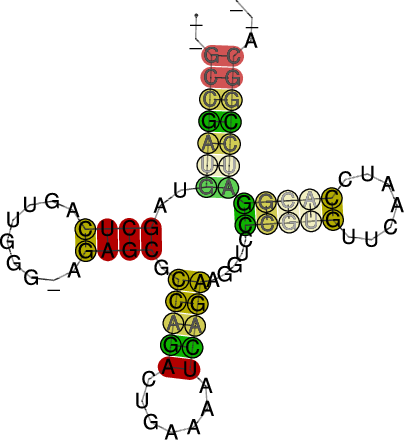

==========================
The Program ``RNAalifold``
==========================

.. contents:: Table of Contents
    :depth: 1
    :local:

Introduction
============

``RNAalifold`` generalizes the folding algorithm for multiple sequence
alignments (MSA), treating the entire alignment as a single *generalized
sequence*.  To assign an energy to a structure on such a generalized
sequence, the energy is simply averaged over all sequences in the 
alignment. This average energy is augmented by a covariance term, that
assigns a bonus or penalty to every possible base pair :math:`(i,j)`
based on the sequence variation in columns :math:`i` and :math:`j` of
the alignment.

Compensatory mutations are a strong indication of structural
conservation, while consistent mutations provide a weaker signal. The
covariance term used by ``RNAalifold`` therefore assigns a bonus
of 1 kcal/mol to each consistent and 2 kcal/mol for each compensatory
mutation. Sequences that cannot form a standard base pair incur a
penalty of :math:`-1` kcal/mol. Thus, for every possible consensus pair
between two columns :math:`i` and :math:`j` of the alignment a covariance score
:math:`C_{ij}` is computed by counting the fraction of sequence pairs
exhibiting consistent and compensatory mutations, as well as the
fraction of sequences that are inconsistent with the pair. The weight
of the covariance term relative to the normal energy function, as well
as the penalty for inconsistent mutations can be changed via command
line parameters.

Apart from the covariance term, the folding algorithm in
``RNAalifold`` is essentially the same as for single sequence
folding. In particular, folding an alignment containing just one
sequence will give the same result as single sequence folding using
``RNAfold``. For :math:`N` sequences of length :math:`n` the required CPU
time scales as :math:`\mathcal{O}(N\cdot n^2 + n^3)` while memory
requirements grow as the square of the sequence length. Thus
``RNAalifold`` is in general faster than folding each sequence
individually. The main advantage, however, is that the accuracy of
consensus structure predictions is generally much higher than for
single sequence folding, where typically only between 40% and 70% of
the base pairs are predicted correctly.

Apart from prediction of ``MFE`` structures ``RNAalifold``
also implements an algorithm to compute the partition function over
all possible (consensus) structures and the thermodynamic equilibrium
probability for each possible pair. These base pairing probabilities
are useful to see structural alternatives, and to distinguish well
defined regions, where the predicted structure is most likely correct,
from ambiguous regions.

As a first example we'll produce a consensus structure prediction for
the following four tRNA sequences.

.. code::

  $ cat > four.seq
  >M10740 Yeast-PHE
  GCGGAUUUAGCUCAGUUGGGAGAGCGCCAGACUGAAGAUUUGGAGGUCCUGUGUUCGAUCCACAGAAUUCGCA
  >K00349 Drosophila-PHE
  GCCGAAAUAGCUCAGUUGGGAGAGCGUUAGACUGAAGAUCUAAAGGUCCCCGGUUCAAUCCCGGGUUUCGGCA
  >K00283 Halobacterium volcanii Lys-tRNA-1
  GGGCCGGUAGCUCAUUUAGGCAGAGCGUCUGACUCUUAAUCAGACGGUCGCGUGUUCGAAUCGCGUCCGGCCCA
  >AF346993
  CAGAGUGUAGCUUAACACAAAGCACCCAACUUACACUUAGGAGAUUUCAACUUAACUUGACCGCUCUGA

``RNAalifold`` uses aligned sequences as input. Thus, our first step will be
to align the sequences. We use ``clustalw2`` in this example, since it's one
of the most widely used alignment programs and has been shown to work well on
structural RNAs. Other alignment programs can be used (including programs that
attempt to do structural alignment of RNAs), but for this example the resulting
multiple sequence alignment should be in ``Clustal`` format. Get ``clustalw2``
and install it as you have done it with the other packages:
http://www.clustal.org/clustal2.

Consensus Structure from related Sequences
==========================================

- Prepare a sequence file (use file ``four.seq`` and copy it to your working directory)
- Align the sequences
- Compute the consensus structure from the alignment
- Inspect the output files ``alifold.out``, ``alirna.ps``, ``alidot.ps``
- For comparison fold the sequences individually using ``RNAfold``

.. code::

  $ clustalw2 four.seq > four.out

``Clustalw2`` creates two more output files, ``four.aln`` and ``four.dnd``.
For ``RNAalifold`` you need the ``.aln`` file.

.. code::

  $ RNAalifold -p four.aln
  $ RNAfold -p < four.seq

``RNAalifold`` output::

  __GCCGAUGUAGCUCAGUUGGG_AGAGCGCCAGACUGAAAAUCAGAAGGUCCCGUGUUCAAUCCACGGAUCCGGCA__
  ..(((((((..((((.........)))).(((((.......))))).....(((((.......))))))))))))...
   minimum free energy = -15.12 kcal/mol (-13.70 +  -1.43)
  ..(((((({..((((.........)))).(((((.......))))).....(((((.......)))))}))))))...
   free energy of ensemble = -15.75 kcal/mol
   frequency of mfe structure in ensemble 0.361603
  ..(((((((..((((.........)))).(((((.......))))).....(((((.......))))))))))))... -15.20 {-13.70 +  -1.50}

``RNAfold`` output::

  >M10740 Yeast-PHE
  GCGGAUUUAGCUCAGUUGGGAGAGCGCCAGACUGAAGAUUUGGAGGUCCUGUGUUCGAUCCACAGAAUUCGCA
  ((((((((........((((.((((((..((((...........))))..))))))..))))..)))))))). (-21.60)
  ((((((({...,,.{,((((.((((((..((((...........))))..))))))..))))),)))))))). [-23.20]
  ((((((((.........(((.((((((..((((...........))))..))))))..)))...)))))))). {-20.00 d=9.63}
   frequency of mfe structure in ensemble 0.0744065; ensemble diversity 15.35 
  >K00349 Drosophila-PHE
  [...]

The output contains a consensus sequence and the consensus structure in
dot-bracket notation. The consensus structure has an energy of
:math:`-15.12` kcal/mol, which in turn consists of the average free energy of
the structure :math:`-13.70` kcal/mol and the covariance term :math:`-1.43`
kcal/mol. The strongly negative covariance term shows that there must be a
fair number of consistent and compensatory mutations, but in contrast to the
average free energy it's not meaningful in the biophysical sense.

Compare the predicted consensus structure with the structures predicted for
the individual sequences using ``RNAfold``. How often is the correct
``clover-leaf`` shape predicted?

For better visualization, a structure annotated alignment or color annotated
structure drawing can be generated by using the ``--aln`` and ``--color``
options of ``RNAalifold``.

.. code::

  $ RNAalifold --color --aln four.aln
  $ gv aln.ps &
  $ gv alirna.ps &

``RNAalifold`` Output Files
===========================

Content of the ``alifold.out`` file::

  4 sequence; length of alignment 78
  alifold output
      6    72  0  99.8%   0.007 GC:2    GU:1    AU:1   
     33    43  0  98.9%   0.033 GC:2    GU:1    AU:1   
     31    45  0  99.0%   0.030 CG:3    UA:1   
     15    25  0  98.9%   0.045 CG:3    UA:1   
      5    73  1  99.7%   0.008 CG:2    GC:1   
     13    27  0  99.1%   0.042 CG:4   
     14    26  0  99.1%   0.042 UA:4   
      4    74  1  99.5%   0.015 CG:3   
  [...]

The last output file produced by ``RNAalifold -p``, named ``alifold.out``,
is a plain text file with detailed information on all plausible base pairs
sorted by the likelihood of the pair.  In the example above we see that the
pair :math:`(6,72)` has no inconsistent sequences, is predicted almost with
probability 1, and occurs as a ``GC`` pair in two sequences, a ``GU`` pair
in one, and a ``AU`` pair in another.

``RNAalifold`` automatically produces a drawing of the consensus structure
in Postscript format and writes it to the file ``alirna.ps``. In the
structure graph consistent and compensatory mutations are marked by a
circle around the variable base(s), i.e. pairs where one pairing partner
is encircled exhibit consistent mutations, whereas pairs supported by
compensatory mutations have both bases marked. Pairs that cannot be formed
by some of the sequences are shown gray instead of black.

The structure layout and dotplot files ``alirna.ps`` and ``alidot.ps``
should look as follows:

|alirna| |alidot|

.. |alidot| image:: ../gfx/tutorial/alidot.png
   :width: 45%

In the example given, many pairs show such inconsistencies. This is because
one of the sequences (AF346993) is not aligned well by ``clustalw``.

.. note::

  Subsequent calls to ``RNAalifold`` will overwrite any existing output
  ``alirna.ps`` (``alidot.ps``, ``alifold.out``) files in the current
  directory. Be sure to rename any files you want to keep.

Structure predictions for the individual sequences
==================================================

The consensus structure computed by ``RNAalifold`` will contain only
pairs that can be formed by most of the sequences. The structures of the
individual sequences will typically have additional base pairs that are not
part of the consensus structure. Moreover, ncRNA may exhibit a highly
conserved core structure while other regions are more variable. It may
therefore be desirable to produce structure predictions for one particular
sequence, while still using covariance information from other sequences.

This can be accomplished by first computing the consensus structure for all
sequences using ``RNAalifold``, then folding individual sequences using
``RNAfold -C`` with the consensus structure as a constraint. In
constraint folding mode ``RNAfold -C`` allows only base pairs to form
which are compatible with the constraint structure. This resulting
structure typically contains most of the constraint (the consensus
structure)  plus some additional pairs that are specific for this sequence.

The ``refold.pl`` script removes gaps and maps the consensus structure to
each individual sequence.

.. code::

  $ RNAalifold  RNaseP.aln > RNaseP.alifold
  $ gv alirna.ps
  $ refold.pl RNaseP.aln RNaseP.alifold | head -3 > RNaseP.cfold
  $ RNAfold -C --noLP < RNaseP.cfold > RNaseP.refold
  $ gv E-coli_ss.ps

If you compare the refolded structure (``E-coli_ss.ps``) with the
structure you get by simply folding the E.coli sequence in the
``RNaseP.seq`` file (``RNAfold --noLP``) you find a clear rearrangement.

In cases where constrained folding results in a structure that is very
different from the consensus, or if the energy from constrained
folding is much worse than from unconstrained folding, this may
indicate that the sequence in question does not really share a common
structure with the rest of the alignment or is misaligned. One should
then either remove or re-align that sequence and recompute the
consensus structure.

.. note::

  Note that since RNase P forms sizable pseudo-knots, a perfect
  prediction is impossible in this case.
