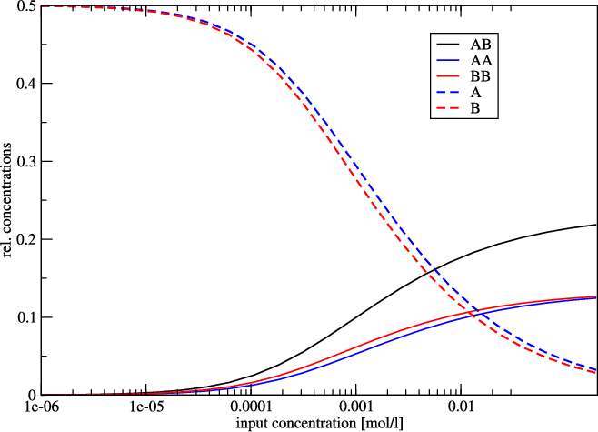

=========================
The Program ``RNAcofold``
=========================

.. contents:: Table of Contents
    :maxdepth: 1
    :local:

Introduction
============

``RNAcofold`` works much like ``RNAfold`` but uses two RNA sequences as input
which are then allowed to form a dimer structure. In the input the two RNA
sequences should be concatenated using the ``&`` character as separator. As
in ``RNAfold`` the ``-p`` option can be used to compute partition function
and base pairing probabilities.

Since dimer formation is concentration dependent, ``RNAcofold`` can be used
to compute equilibrium concentrations for all five monomer and
(homo/hetero)-dimer species, given input concentrations for the monomers
(see the ``man`` page for details).

Two Sequences one Structure
===========================

- Prepare a sequence file (``t.seq``) for input that looks like this::

    >t
    GCGCUUCGCCGCGCGCC&GCGCUUCGCCGCGCGCA

- Compute the ``MFE`` and the ensemble properties
- Look at the generated PostScript files ``t_ss.ps`` and ``t_dp.ps``

.. code::

  $ RNAcofold -p < t.seq
  >t
  GCGCUUCGCCGCGCGCC&GCGCUUCGCCGCGCGCA
  ((((..((..((((...&))))..))..))))... (-17.70)
  ((((..{(,.((((,,.&))))..}),.)))),,. [-18.26]
   frequency of mfe structure in ensemble 0.401754 , delta G binding= -3.95

.. list-table:: Secondary Structure and Dot Plot
   :widths: 50 50
   :align: center

   * - .. image:: ../gfx/tutorial/t_ss.png
     - .. image:: ../gfx/tutorial/t_dp.png

In the dot plot a cross marks the chain break between the two concatenated sequences.

Concentration Dependency
========================

Cofolding is an intermolecular process, therefore whether duplex formation will
actually occur is concentration dependent. Trivially, if one of the molecules is
not present, no dimers are going to be formed. The partition functions of the
molecules give us the equilibrium constants:

.. math::

   K_{AB} = \frac{[AB]}{[A][B]} = \frac{Z_{AB}}{Z_AZ_B}

with these and mass conservation, the equilibrium concentration of homodimers,
heterodimers and monomers can be computed in dependence of the start concentrations
of the two molecules.

This is most easily done by creating a file with the initial concentrations of
molecules :math:`A` and :math:`B` in two columns::
   [a_1]([mol/l])  [b_1]([mol/l])
   [a_2]([mol/l])  [b_2]([mol/l])

   [...]

   [a_n]([mol/l])  & [b_n]([mol/l])

- Prepare a concentration file for input with this little ``perl`` script::

    $ perl -e '$c=1e-07; do {print "$c\t$c\n"; $c*=1.71;} while $c<0.2' > concfile

  This script creates a file displaying values from 1e-07 to just below 0.2,
  with 1.71-fold steps in between. For convenience, concentration of molecule A
  is the same as concentration of molecule B in each row. This will facilitate
  visualization of the results.

- Compute the ``MFE``, the ensemble properties and the concentration dependency
  of hybridization::

    $ RNAcofold -f concfile < t.seq > cofold.out

- Look at the generated output with::

    $ less cofold.out

  which should be similar to::

    [...]
    Free Energies:
    AB              AA              BB              A               B
    -18.261023      -17.562553      -18.274376      -7.017902       -7.290237
    Initial concentrations          relative Equilibrium concentrations
    A                B               AB              AA              BB              A               B
    1e-07           1e-07           0.00003         0.00002         0.00002         0.49994         0.49993
    [...]

The five different free energies were printed out first, followed by a list
of all the equilibrium concentrations, where the first two columns denote the
initial (absolute) concentrations of molecules :math:`A` and :math:`B`,
respectively. The next five columns denote the equilibrium concentrations
of dimers and monomers, relative to the total particle number.

.. note::

  The concentrations don't add up to one, except in the case where no dimers
  are built -- if you want to know the fraction of particles in a dimer, you
  have to take the relative dimer concentrations times 2.

Since relative concentrations of species depend on two independent values -
initial concentration of A as well as initial concentration of B - it is not
trivial to visualize the results. For this reason we used the same concentration
for A and for B. Another possibility would be to keep the initial concentration of
one molecule constant.
As an example we show the following plot of ``t.seq``.

Now we use some commandline tools to render our plot. We use ``tail -n +11`` to
show all lines starting with line 11 (1-10 are cut) and pipe it into an ``awk``
command, which prints every column but the first from our input.
This is then piped to ``xmgrace``.
With ``-log x -nxy -`` we tell it to plot the x axis in logarithmic scale and to
read data file in X Y1 Y2 ... format.

.. code::

  $ tail -n +11 cofold.out | awk '{print $2, $3, $4, $5, $6, $7}' | xmgrace -log x -nxy -

Concentration Dependency Plot
=============================

Since the two sequences are almost identical, the monomer and homo-dimer
concentrations behave very similarly. In this example, at a concentration of
about 1 mmol 50% of the molecule is still in monomer form.
