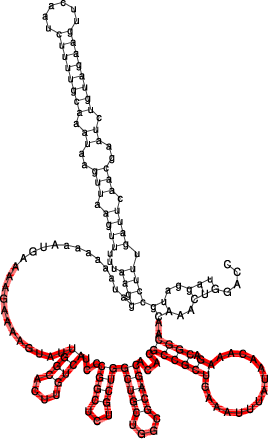
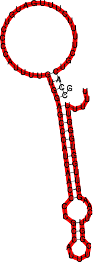
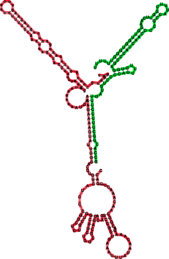

=========================
The Program ``RNAduplex``
=========================

.. contents:: Table of Contents
    :depth: 1
    :local:

Introduction
============

If the sequences are very long (many kb) ``RNAcofold`` is too slow
to be useful. The ``RNAduplex`` program is a fast alternative, that works by
predicting *only* intermolecular base pairs. It's almost as fast as simple
sequence alignment, but much more accurate than a ``BLAST`` search.

The example below searches the 3' UTR of an mRNA for a miRNA binding site.

Binding site prediction with ``RNAduplex``
==========================================

The file ``duplex.seq`` contains the 3'UTR of ``NM_024615`` and the
microRNA mir-145.

.. code::

  $ RNAduplex < duplex.seq
  >NM_024615
  >hsa-miR-145
  .(((((.(((...((((((((((.&)))))))))))))))))).  34,57  :   1,19  (-21.90)

Most favorable binding has an interaction energy of -21.90 kcal/mol and pairs
up on positions 34-57 of the UTR with positions 1-22 of the miRNA.

``RNAduplex`` can also produce alternative binding sites, e.g. running
``RNAduplex -e 10`` would list all binding sites within 10 kcal/mol of
the best one.

Since ``RNAduplex`` forms only intermolecular pairs, it neglects the
competition between intramolecular folding and hybridization. Thus, it is
recommended to use ``RNAduplex`` as a pre-filter and analyse good
``RNAduplex`` hits additionally with ``RNAcofold`` or
``RNAup``. Using the example above, running ``RNAup`` will yield:

Binding site prediction with ``RNAup``
======================================

.. code::

  $ RNAup -b < duplex.seq
  >NM_024615
  >hsa-miR-145
  (((((((&)))))))  50,56  :   1,7   (-8.41 = -9.50 + 0.69 + 0.40)
  GCUGGAU&GUCCAGU
  RNAup output in file: hsa-miR-145_NM_024615_w25_u1.out

The free energy of the duplex is -9.50 kcal/mol and shows a discrepancy to the
structure and energy value computed by ``RNAduplex`` (differences may arise from
the fact that ``RNAup`` computes partition functions rather than optimal
structures).

However, the total free energy of binding is less favorable (-8.41 kcal/mol),
since it includes the energetic penalty for opening the binding site on the
mRNA (0.69 kcal/mol) and miRNA (0.40 kcal/mol). The ``-b`` option includes the
probability of unpaired regions in both RNAs. 

You can also run ``RNAcofold`` on the example to see the complete structure
after hybridization (neither ``RNAduplex`` nor ``RNAup`` produce structure
drawings). Note however, that the input format for ``RNAcofold`` is different.
An input file suitable for ``RNAcofold`` has to be created from the
``duplex.seq`` file first (use any text editor).

As a more difficult example, let's look at the interaction of the bacterial
smallRNA RybB and its target mRNA ompN. First we'll try predicting the binding
site using ``RNAduplex``:

.. code::

  $ RNAduplex < RybB.seq
  >RybB
  >ompN
  .((((..((((((.(((....((((((((..(((((.((..((.((....((((..(((((((((((..((((((&
  .))))))..))))))).)))).....))))....)).)).)).))).))..))))........))))..))).)))))).)))).  
   5,79  :  80,164 (-34.60)

Note, that the predicted structure spans almost the full length of the RybB small RNA.
Compare the predicted interaction to the structures predicted for RybB and ompN alone,
and ask yourself whether the predicted interaction is indeed plausible.

Below the structure of ompN on the left and RybB on the right side. The respective
binding regions predicted by RNAduplex are marked in red:

|ompN| |rybB|

.. code::

  GCCAC-----TGCTTTTCTTTGATGTCCCCATTTT-GTGGA-------GC-CCATCAACCCCGCCATTTCGGTT---CAAG-GTTGGTGGGTTTTTT
   |||      ||||  |||||| |||    ||||| ||||        || ||| || ||  ||    ||||     |||| ||  |||  |||||| -40.30
  AGGTCAAACAACGGC-AGAAACAATATT--TAAAGTCGCCGCACACGACGCGGTCGTCGGT-CGTCTCGGCCCTACTGTTCACGGTTATGAAAAGAAACC-3'

Compare the ``RNAduplex`` prediction with the interaction predicted by
``RNAcofold``, ``RNAup`` and the handcrafted prediction you see above.

