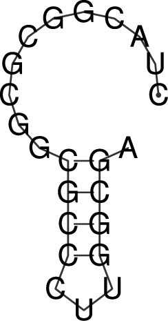
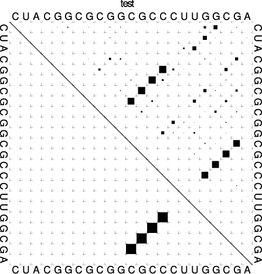
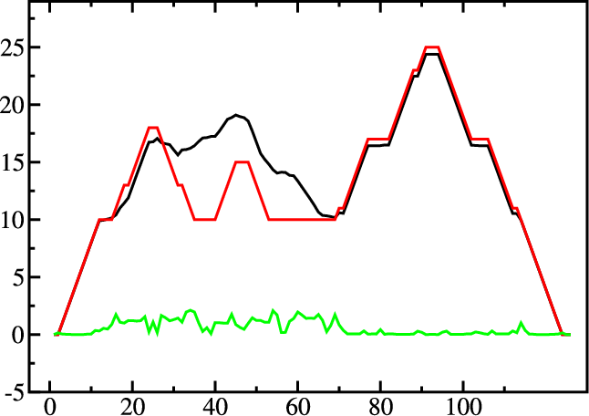
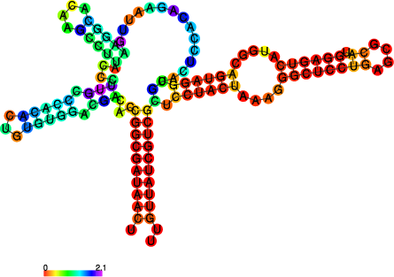
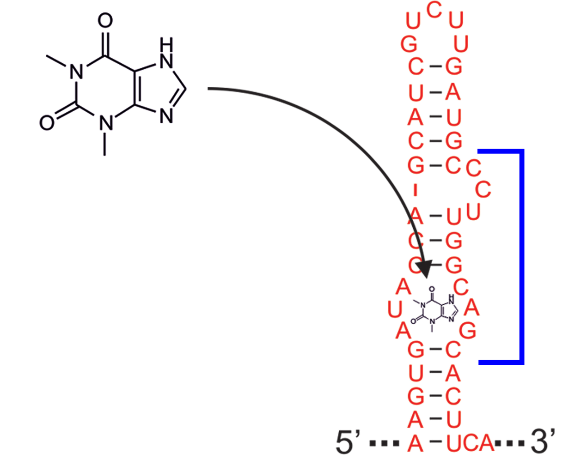
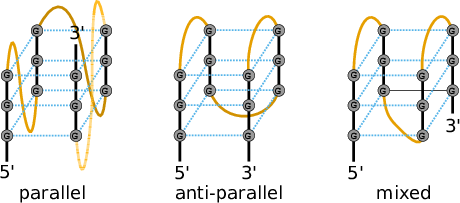
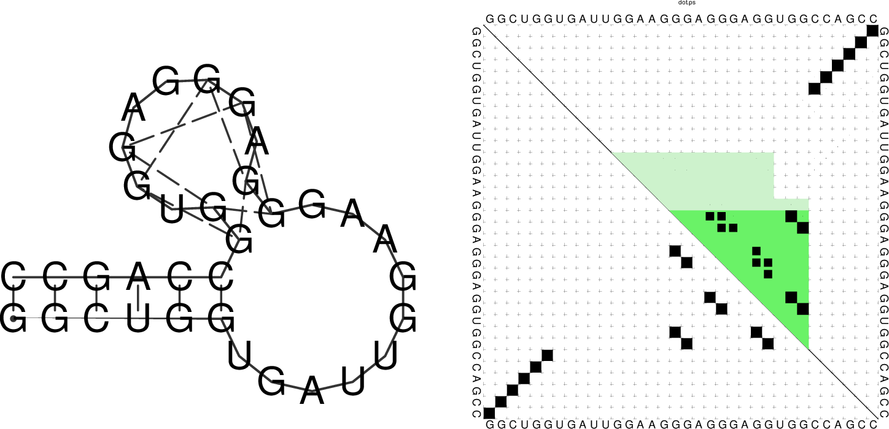
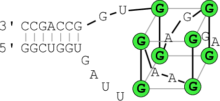
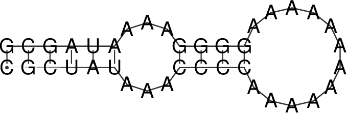
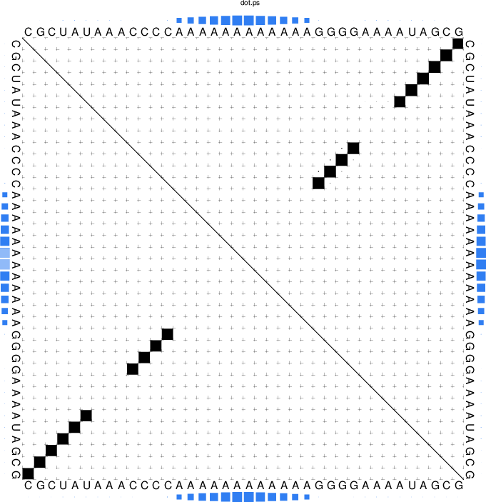

=======================
The Program ``RNAfold``
=======================

.. contents:: Table of Contents
    :maxdepth: 1
    :local:

Introduction
============

Our first task will be to do a structure prediction using
``RNAfold``. This should get you familiar with the input and output
format as well as the graphical output produced.

``RNAfold`` reads single RNA sequences, computes their minimum free energy
(``MFE``) structures, and prints the result together with the corresponding
``MFE`` structure in dot-bracket notation. This is the default mode if no
further command line parameters are provided. Please note, that the ``RNAfold``
program can either be used in *interactive mode*, where the program expects
the input from *stdin*, or in *batch processing mode* where
you provide the input sequences as text files. 

.. rubric:: Partition function

To activate computation of the partition function for each sequence, the
``-p`` option must be set. From the partition function

.. math::

    Q = \sum_{s \in \Omega} exp(-E(s) / RT)

over the ensemble of all possible structures :math:`\Omega`, with temperature :math:`T` and gas
constant :math:`R`, ``RNAfold`` then computes the ensemble free energy :math:`G = -RT \cdot ln(Q)`,
and frequency of the ``MFE`` structure :math:`s_{mfe}` within the ensemble

.. math::

    p = exp(-E(s_{mfe}) / RT) / Q

.. rubric:: Ensemble diversity

By default, the ``-p`` option also activates the computation
of base pairing probabilities :math:`p_{ij}`. From this data, ``RNAfold`` then
determines the ensemble diversity

.. math::

    \langle d \rangle = \sum_{ij} p_{ij} \cdot (1 - p_{ij}),

i.e. the expected distance between any two secondary structure, as well as the
``centroid`` structure, i.e. the structure :math:`s_c` with the least Boltzmann weighted
distance

.. math::

    d_\Omega(s_c) = \sum_{\substack{s \in \Omega}} p(s) d(s_c, s)

to all other structures :math:`s \in \Omega`.

.. rubric:: Maximum Expected Accuracy

Another useful structure representative one can determine from base pairing probabilities
:math:`p_{ij}` is the structure that exhibits the *maximum expected accuracy (MEA)*. By
assuming the base pair probability is a good measure of correctnes of a pair :math:`(i,j)`, the
expected accuracy of a structure :math:`s` is

.. math::

    \text{EA}(s) = \sum_{\substack{(i,j) \in s}} 2\gamma p_{ij} + \sum_{\substack{i \\ \nexists (i,j) \in s}} q_i

with :math:`q_i = 1 - \sum_j p_{ij}` and weighting factor :math:`\gamma` that allows us to
weight paired against unpaired positions. ``RNAfold`` uses a dynamic programming
scheme similar to the *Maximum Matching algorithm* of Ruth Nussinov to find the
structure :math:`s` that minimizes the above equation.

The ``RNAfold`` program provides a large amount of additional
computation modes that will be partly covered below. To get a full list of all
computation modes available, please consult the ``RNAfold`` man page or
the outputs of ``RNAfold -h`` and ``RNAfold --detailed-help``.

MFE structure of a single sequence
==================================

- Use a text editor (emacs, vi, nano, gedit) to prepare an input file by pasting the text
  below and save it under the name ``test.seq`` in your ``Data`` folder::

  > test
  CUACGGCGCGGCGCCCUUGGCGA

- Compute the best (MFE) structure for this sequence using *batch processing mode*

  .. code::

    $ RNAfold test.seq
    CUACGGCGCGGCGCCCUUGGCGA
    ...........((((...)))). ( -5.00)

- or use the *interactive mode* and redirect the content of ``test.seq``
  to *stdin*

  .. code::

    $ RNAfold < text.seq
    CUACGGCGCGGCGCCCUUGGCGA
    ...........((((...)))). ( -5.00)

- alternatively, you could use the *interactive mode* and manually enter the sequence
  as soon as ``RNAfold`` prompts for input

  .. code::

    $ RNAfold
    Input string (upper or lower case); @ to quit
    ....,....1....,....2....,....3....,....4....,....5....,....6....,....7....,....8
    CUACGGCGCGGCGCCCUUGGCGA
    length = 23

    CUACGGCGCGGCGCCCUUGGCGA
    ...........((((...)))).
     minimum free energy =  -5.00 kcal/mol

All the above variants to compute the MFE and the corresponding structure result in identical
output, except for slight variations in the formatting when true *interactive mode* is used.
The last line(s) of the text output contains the predicted MFE structure in *dot-bracket notation*
and its free energy in ``kcal/mol``. A dot in the dot-bracket notation represents an unpaired
position, while a base pair (i, j) is represented by a pair of matching parentheses at position
i and j.

If the input was ``FASTA`` formatted, i.e. the sequence was preceded by a header line
with sequence identifier, ``RNAfold`` creates a structure layout file named ``test_ss.ps``,
where ``test`` is the sequence identifier as provided through the ``FASTA`` header.
In case the header was omitted the output file name simply is ``rna.ps``.\\
Let's take a look at the output file with your favorite ``PostScript`` viewer, e.g. ``gv``.\footnote{In contrast to
  bitmap based image files (such as GIF or JPEG) PostScript files contain resolution
  independent vector graphics, suitable for publication. They can be
  viewed on-screen using a postscript viewer such as ``gv`` or
  ``evince``}. Note the \& at the end of the following command line that simply detaches
the program call and immediately starts the program in the background.

.. code:: bash

  $ gv test_ss.ps &

Compare the dot-bracket notation to the PostScript drawing shown in the file ``test_ss.eps``.

You can use the ``-t`` option to change the layout algorithm ``RNAfold`` uses
to produce the plot. The most simply layout is the *radial* layout that can be chosen
with ``-t 0``. Here, each nucleotide in a loop is equally spaced on its enclosing circle.
The more sophisticated ``Naview`` layout algorithm is used by default but may be explicitly
chosen through ``-t 1``. A hidden feature can be found with ``-t 2``, where ``RNAfold``
creates a most simple circular plot.

The calculation above does not tell us whether we can actually trust the predicted structure.
In fact, there may be many more possible structures that might be equally probable. To find
out about that, let's have a look at the equilibrium ensemble instead.

Equilibrium ensemble properties
===============================

- Run::

  $ RNAfold -p --MEA

  to compute the partition function, pair probabilities, centroid structure,
  and the maximum expected accuracy (MEA) structure.
- Have a look at the generated PostScript files ``test_ss.ps`` and
  ``test_dp.ps``

  .. code::

    $ RNAfold -p --MEA test.seq 
    CUACGGCGCGGCGCCCUUGGCGA
    ...........((((...)))). ( -5.00)
    ....{,{{...||||...)}}}. [ -5.72]
    ....................... {  0.00 d=4.66}
    ......((...))((...))... {  2.90 MEA=14.79}
     frequency of mfe structure in ensemble 0.311796; ensemble diversity 6.36  

Here the last four lines are new compared to the text output without the ``-p --MEA`` 
options. The partition function is already a rough measure for the well-definedness of the ``MFE``
structure. The third line shows a condensed representation of the pair probabilities of each 
nucleotide, similar to the dot-bracket notation, followed by the ensemble free energy
(:math:`G = -kT \cdot ln(Z)`) in units of ``kcal/mol``. Here, the dot-bracket like notation consists
of additional characters that denote the pairing propensity for each nucleotide. 
``.`` denotes bases that are essentially unpaired, ``,`` weakly paired, 
``|`` strongly paired without preference, ``{}``, ``()`` weakly (:math:`>` 33%) upstream (downstream) 
paired or strongly (:math:`>` 66%) up-/downstream paired bases, respectively.

The next two lines represent (i) the centroid structure
with its free energy and distance to the ensemble, and (ii) the MEA structure, it's free
energy and the actual accuracy. The very last line shows the frequency of the MFE structure in 
the ensemble of secondary structures and the diversity of the ensemble as discussed above.

Note that the MFE structure is adopted only with 31% probability, also the
diversity is very high for such a short sequence.

Rotate the structure plot
=========================

To rotate the secondary structure plot that is generated by ``RNAfold``
the ``ViennaRNA Package`` provides the perl script utility ``rotate_ss.pl``.
Just read the ``perldoc`` for this tool to know how to handle the rotation and use
the information to get your secondary structure in a vertical position.

.. code::

  $ perldoc rotate_ss.pl

The base pair probability dot plot
==================================

The *dot plot* (``test_dp.ps``) shows the pair probabilities within
the equilibrium ensemble as :math:`n\times n` matrix, and is an excellent way to
visualize structural alternatives. A square at row :math:`i` and column :math:`j`
indicates a base pair. The area of a square in the upper right half of the
matrix is proportional to the probability of the base pair :math:`(i,j)` within the
equilibrium ensemble. The lower left half shows all pairs belonging to
the ``MFE`` structure. While the MFE consists of a single helix, several
different helices are visualized in the pair probabilities.

While a base pair probability dot-plot is quite handy to interpret for short
sequences, it quickly becomes confusing the longer the RNA sequence is. Still,
this is (currently) the only output of base pair probabilities for the ``RNAfold``
program. Nevertheless, since the dot plot is a true ``PostScript`` file,
one can retrieve the individual base pair probabilities by parsing its textual
content.

- Open the dot plot with your favorite text editor
- Locate the lines that that follow the scheme

  .. code::

    i j v ubox

  where :math:`i` and :math:`j` are integer values and :math:`v` is a floating point decimal
  with values between :math:`0` and :math:`1`. These are the data for the boxes drawn in
  the upper triangle. The integer values :math:`i` and :math:`j` denote the nucleotide positions
  while the value :math:`v` is the square-root of the probability of base pair :math:`(i,j)`.
  Thus, the actual base pair probability :math:`p(i,j) = v \cdot v`.

Mountain and Reliability plot
=============================

Next, let's use the ``relplot.pl`` utility to annotate which parts of a
predicted MFE structure are well-defined and thus more reliable. Also let's use a real 
example for a change and produce yet another representation of the predicted 
structure, the *mountain plot*.

Fold the 5S rRNA sequence and visualize the structure. (The ``5S.seq`` is shipped with the tutorial)

.. code:: bash

  $ RNAfold -p 5S.seq
  $ mountain.pl 5S_dp.ps | xmgrace -pipe
  $ relplot.pl 5S_ss.ps 5S_dp.ps > 5S_rss.ps

|mnt_plot| and |rot_img|

A mountain plot is especially useful for long sequences where conventional
structure drawings become terribly cluttered.  It is a xy-diagram plotting
the number of base pairs enclosing a sequence position *versus* the
position. The  ``Perl`` script ``mountain.pl`` transforms a dot
plot into the mountain plot coordinates which can be visualized with any
xy-plotting program, e.g. ``xmgrace``.

The resulting plot shows three curves, two mountain plots derived from
the ``MFE`` structure (red) and the pairing probabilities (black) and
a positional entropy curve (green). Well-defined regions are identified by low
entropy. By superimposing several mountain plots structures can easily
be compared.

The perl script ``relplot.pl`` adds reliability
information to a RNA secondary structure plot in the form of color
annotation. The script computes a well-definedness measure we call
``positional entropy''

.. math::

    S(i) = -\sum p_{ij}\log(p_{ij})

and encodes it as color hue, ranging from red
(low entropy, well-defined) via green to blue and violet (high
entropy, ill-defined). In the example above two helices of the 5S RNA are
well-defined (red) and indeed predicted correctly, the left arm is not quite
correct and disordered.

For the figure above we had to rotate and mirror the structure plot, e.g.

.. code::

  $ rotate_ss.pl -a 180 -m 5S_rss.ps > 5S_rot.ps

Batch job processing
====================

In most cases, one doesn't only want to predict the structure and equilibrium
probabilities for a single RNA sequence but a set of sequences. ``RNAfold``
is perfectly suited for this task since it provides several different mechanisms
to support batch job processing. First, in *interactive* mode, it only
stops processing input from *stdin* if it is requested to do so. This means
that after processing one sequence, it will prompt for the input of the next
sequence. Entering the ``@`` character will forcefully abort processing.
In situations where the input is provided through input stream redirection,
it will end processing as soon stream is closed.

In constrat to that, the *batch processing mode* where one simply specifies
input files as so-called unnamed command line parameters, the number of input
sequences is more or less unlimited. You can specify as many input files as
your terminal emulator allows, and each input file may consist of arbitrarily
many sequences. However, please note that mixing ``FASTA`` and non-fasta
input is not allowed and will most likely produce bogus output.

Assume you have four input files ``file_0.fa``, ``file_1.fa``,
``file_2.fa``, and ``file_3.fa``. Each file contains a set of RNA
sequences in ``FASTA`` format. Predicting secondary structures for all
sequences in all files with a single call to ``RNAfold`` and redirecting
the output to a file ``all_sequences_output.fold`` can be achieved
like this:
.. code::

  $ RNAfold file_0.fa file_1.fa file_2.fa file_3.fa > all_sequences_output.fold

The above call to ``RNAfold`` will open each of the files and process the
sequences sequentially. This, however, might take a long time and the sequential
processing will most likely bore out your multi-core workstation or laptop computer,
since only a single core is used for the computations while the others are idle.
If you happen to have more than a single CPU core and want to take advantage of
the available parallel processing power, you can use the ``-j`` option of\
``RNAfold`` to split the input into concurrent jobs.
.. code::

  $ RNAfold -j file_*.fa > all_sequences_output.fold

This command will uses as many CPU cores as available and, therefore, process
you input much faster. If you want to limit the number of concurrent jobs to
a particular number, say :math:`2`, to leave the remaining cores available for other
tasks, you can append the number of jobs directly to the ``-j`` option:
.. code::

  $ RNAfold -j2 file_*.fa > all_sequences_output.fold

Note here, that there must not be any space between the ``j`` and the number
of jobs.

Now imagine what happens if you have a larger set of
sequences that are not stored in ``FASTA`` format. If you would serve such
an input to ``RNAfold``, it would happily process each of the sequences
but always over-write the structure layout and dot-plot files, since the default
names for these files are ``rna.ps`` and ``dot.ps`` for any sequence.
This is usually an undesired behavior, where ``RNAfold`` and the ``--auto-id``
option becomes handy. This option flag forces ``RNAfold`` to automatically
create a sequence identifier for each input, thus using different file names for
each single output. The identifier that is created follows the form
.. code::

  sequence_XXXX

where ``sequence`` is a prefix, followed by the delimiting character ``_``,
and an increasing 4-digit number ``XXXX`` starting at 0000. This feature is
even useful if the input is in ``FASTA`` format, but one wants to enforce
a novel naming scheme for the sequences. As soon as the ``--auto-id`` option
is set, ``RNAfold`` will ignore any id taken from existing ``FASTA``
headers in the input files.

See also the man page of ``RNAfold`` to find out how to modify the prefix,
delimiting character, start number and number of digits.

- Create an input file with many RNA sequences, each on a separate line, e.g.::

    $ randseq -n 127 > many_files.seq

- Compute the MFE structure for each of the sequences and generate output
  ids with numbers between :math:`100` and :math:`226` and prefix ``test_seq``::

    $ RNAfold --auto-id --id-start=100 --id-prefix="test_seq" many_files.seq

Add constraints to the structure prediction
===========================================

For some scientific questions one requires additional constraints that must be
enforced when predicting secondary structures. For instance, one might have resolved
parts of the structure already and is simply interested in the optimal conformation
of the remaining part of the molecule. Another example would be that one already
knows that particular nucleotides can not participate in any base pair, since they
are physically hindered to do so. These types of constraints are termed *hard*
constraints and they can enforce or prohibit particular conformations, thus include
or omit structures with these feature from the set candidate ensemble.

Another type of constraints are so-called *soft* constraints, that enable one
to adjust the free energy contributions of particular conformations. For instance,
one could add a bonus energy if a particular (stretch of) nucleotides is left unpaired
to emulate the binding free energy of a single strand binding protein. The same can
be applied to base pairs, for instance one could add a penalizing energy term if a
particular base pair is formed to make it less likely.

The ``RNAfold`` programs comes with a comprehensive hard and soft constraints
support and provides several convenience command line parameters to ease constraint
application.

The most simple hard constraint that can be applied is the maximum base pair span, i.e.
the maximum number of nucleotides a particular base pair may span. This constraint can
be applied with the ``--maxBPspan`` option followed by an integer number.

- Compute the secondary structure for the ``5S.seq`` input file
- Now limit the maximum base pair span to :math:`50` and compare both results::

    $ RNAfold --maxBPspan 50 5S.seq

Now assume you already know parts of the structure and want to *fill-in*
an optimal remaining part. You can do that by using the ``-C`` option
and adding an additional line in dot-bracket notation to the input (after the sequence)
that corresponds to the known structure:

- Prepare the input file ``hard_const_example.fa``::

    >my_constrained_sequence
    GCCCUUGUCGAGAGGAACUCGAGACACCCACUACCCACUGAGGACUUUCG
    ..((((.....))))

  Note here, that we left out the remainder of the input structure constraint that will
  eventually be used to enforce a helix of 4 base pairs at the beginning of the sequence.
  You may also fill the remainder of the constraint with dots to silence any warnings issued
  by ``RNAfold``.

- Compute the MFE structure for the input::

    $ RNAfold hard_const_example.fa
    >my_constrained_sequence
    GCCCUUGUCGAGAGGAACUCGAGACACCCACUACCCACUGAGGACUUUCG
    ........((((((...((((.................))))..)))))) ( -8.00)

- Now compute the MFE structure under the provided constraint::

    $ RNAfold -C hard_const_example.fa
    >my_constrained_sequence
    GCCCUUGUCGAGAGGAACUCGAGACACCCACUACCCACUGAGGACUUUCG
    ..((((.....))))....(((((..((((........)).))..))))) ( -7.90)

- Due to historic reasons, the ``-C`` option alone only forbids any base pairs
  that are incompatible with the constraint, rather than enforcing the constraint. Thus,
  if you compute equilibrium probabilities, structures that are missing the small helix in
  the beginning are still part of the ensemble. If you want to compute the pairing probabilities
  upon forcing the small helix at the beginning, you can add the ``--enforceConstraint`` option::

    $ RNAfold -p -C --enforceConstraint hard_const_example.fa
    >my_constrained_sequence
    GCCCUUGUCGAGAGGAACUCGAGACACCCACUACCCACUGAGGACUUUCG
    ..((((.....))))....(((((..((((........)).))..))))) ( -7.90)

  Have a look at the differences in ensemble free energy and base pair probabilities between
  the results obtained with and without the ``--enforceConstraint`` option.

A more thorough alternative to provide constraints is to use the ``--commands`` option
and a corresponding *commands file*. This allows one to specify constraints on nucleotide
or base pair level and even to restrict a constraint to particular loop types. A commands file
is a simple multi column text file with one constraint on each line. A line starts with a one- or
two-letter command, followed by multiple values that specify the addressed nucleotides, the loop
context restriction, and, for soft constraints, the strength of the constraint in :math:`kcal/mol`.
The syntax is as follows:

.. code::

  F i 0 k   [TYPE] [ORIENTATION] # Force nucleotides i...i+k-1 to be paired
  F i j k   [TYPE] # Force helix of size k starting with (i,j) to be formed
  P i 0 k   [TYPE] # Prohibit nucleotides i...i+k-1 to be paired
  P i j k   [TYPE] # Prohibit pairs (i,j),...,(i+k-1,j-k+1)
  P i-j k-l [TYPE] # Prohibit pairing between two ranges
  C i 0 k   [TYPE] # Nucleotides i,...,i+k-1 must appear in context TYPE
  C i j k          # Remove pairs conflicting with (i,j),...,(i+k-1,j-k+1)
  E i 0 k e        # Add pseudo-energy e to nucleotides i...i+k-1
  E i j k e        # Add pseudo-energy e to pairs (i,j),...,(i+k-1,j-k+1)

with

.. code::

  [TYPE]        = { E, H, I, i, M, m, A }
  [ORIENTATION] = { U, D }

- Prepare a commands file ``test.constraints`` that forces the first 5 nucleotides to pair and the
  following 3 nucleotides to stay unpaired as part of a multi-branch loop::

    F 1 0 5
    C 6 0 3 M

- Use the ``randseq`` program to generate multiple sequences and compute the MFE structure
  for each under the constraints prepared earlier::

    $ randseq -n 20 | RNAfold --commands test.constraints

  Inspect the output to assure yourself that hte commands have been applied

A few much more sophisticated constraints will be discussed below.

SHAPE directed RNA folding
==========================

In order to further improve the quality of secondary structure predictions, mapping experiments like
SHAPE (selective 2'-hydroxyl acylation analyzed by primer extension) can be used to exerimentally determine
the pairing status for each nucleotide.
In addition to thermodynamic based secondary structure predictions, RNAfold supports the incorporation of this additional
experimental data as soft constraints.

If you want to use SHAPE data to guide the folding process, please make sure that your experimental data is present in a text file,
where each line stores three white space separated columns containing the position, the abbreviation and the normalized SHAPE reactivity for
a certain nucleotide.

.. code::

    1 G 0.134
    2 C 0.044
    3 C 0.057
    4 G 0.114
    5 U 0.094
       ...
       ...
       ...
    71 C 0.035
    72 G 0.909
    73 C 0.224
    74 C 0.529
    75 A 1.475

The second column, which holds the nucleotide abbreviation, is optional.
If it is present, the data will be used to perform a cross check against the provided input sequence.
Missing SHAPE reactivities for certain positions can be indicated by omitting the reactivity column or the whole line.
Negative reactivities will be treated as missing.
Once the SHAPE file is ready, it can be used to constrain folding:

.. code::

  $ RNAfold --shape=rna.shape --shapeMethod=D < rna.seq

A small compilation of reference data taken from Hajdin et al. 2013 is available online
https://weeks.chem.unc.edu/data-files/ShapeKnots_DATA.zip. However, the included
reference structures are only available in connect (``.ct``) format and require conversion into
dot-bracket notation to compare them against predicted structures with ``RNAfold``.
Furthermore, the normalized ``SHAPE`` data is available as Excel spreadsheet and
also requires some pre-processing to make it available for ``RNAfold``.

Adding ligand interactions
=============================

RNA molecules are known to interact with other molecules, such as additional RNAs, proteins,
or other small ligand molecules. Some interactions with small ligands that take place in
loops of an RNA structure can be modeled in terms of soft constraints. However, to stay
compatible with the recursive decomposition scheme for secondary structures they are
limited to the unpaired nucleotides of hairpins and internal loops.

The ``RNAlib`` library of the ``ViennaRNA Package`` implements a most general
form of constraints capability. However, the available programs do not allow for a full
access to the implemented features. Nevertheless, ``RNAfold`` provides a convenience
option that allows to easily include ligand binding to hairpin- or interior-loop like aptamer
motifs. For that purpose, a user needs only to provide motif and a binding free energy.

Consider the following example file ``theo.fa`` for a theophylline triggered
riboswitch with the sequence::

  >theo-switch
  GGUGAUACCAGAUUUCGCGAAAAAUCCCUUGGCAGCACCUCGCACAUCUUGUUGUC
  UGAUUAUUGAUUUUUCGCGAAACCAUUUGAUCAUAUGACAAGAUUGAG

The theopylline aptamer structure has been actively researched during the last two decades.

Although the actual aptamer part (marked in blue) is not a simple interior loop, it
can still be modeled as such. It consists of two delimiting base pairs (G,C) at the
5' site, and another (G,C) at its 3' end. That is already enough to satisfy the requirements
for the ``--motif`` option of ``RNAfold``. Together with the aptamer sequence
motif, the entire aptamer can be written down in dot-bracket form as::

  GAUACCAG&CCCUUGGCAGC
  (...((((&)...)))...)

Note here, that we separated the 5' and 3' part from each other using the ``&``
character. This enables us to omit the variable hairpin end of the aptamer from the
specification in our model.

The only ingredient that is still missing is the actual stabilizing energy contribution
induced by the ligand binding into the aptamer pocket. But several experimental and computational
studies have already determined dissociation constants for this system. Jenison et al. 1994,
for instance, determined a dissociation constant of :math:`K_d = 0.32\mu M` which, for standard
reference concentration :math:`c = 1 mol/L`, can be translated into a binding free energy

.. math::

    \Delta G = RT \cdot \ln \frac{K_d}{c} \approx -9.22~kcal/mol

Finally, we can compute the MFE structure for our example sequence

.. code::

  $ RNAfold -v --motif "GAUACCAG&CCCUUGGCAGC,(...((((&)...)))...),-9.22" theo.fa

Compare the predicted MFE structure with and without modeling the ligand interaction.
You may also enable partition function computation to compute base pair probabilities,
the centroid structure and MEA structure to investigate the effect of ligand binding
on ensemble diversity.

G-quadruplexes
==============

G-Quadruplexes are a common conformation found in G-rich sequences where four runs of
consecutive G's are separated by three short sequence stretches.

They form local self-enclosed stacks of G-quartets bound together through 8 Hogsteen-Watson
Crick bonds and further stabilized by a metal ion (usually potassium).

To acknowledge the competition of regular secondary structure and G-quadruplex formation,
the ``ViennaRNA Package`` implements an extension to the default recursion scheme.
For that purpose, G-quadruplexes are simply considered a different type of substructure
that may be incorporated like any other substructure. The free energy of a particular
G-quadruplex at temperature :math:`T` is determined by a simple energy model

.. math::

    E(L, l_{tot}, T) = a(t) \cdot (L - 1) + b(T) \cdot ln(l_{tot} - 2)

that only considers the number of stacked layers :math:`L` and the total size of the three
linker sequences :math:`l_{tot} = l_1 + l_2 + l_3` connecting the G runs. Linker sequence
and assymetry effects as well as relative strand orientations (parallel, anti-parallel
or mixed) are entirely neglected in this model. The free energy parameters

.. math::

    a(T) = H_a + TS_a

and

.. math::

    b(T) = H_b + TS_b

have been determined from experimental UV-melting data taken from Zhang et al. 2011,
Biochemistry.

``RNAfold`` allows one to activate the G-quadruplex implementation by simply
providing the ``-g`` switch. G-quadruplexes are then taken into account for
MFE and equilibrium probability computations.

.. code::

  $ echo "GGCUGGUGAUUGGAAGGGAGGGAGGUGGCCAGCC" | RNAfold -g -p
  GGCUGGUGAUUGGAAGGGAGGGAGGUGGCCAGCC
  ((((((..........++.++..++.++)))))) (-21.39)
  ((((((..........(..........))))))) [-21.83]
  ((((((..........++.++..++.++)))))) {-21.39 d=0.04}
   frequency of mfe structure in ensemble 0.491118; ensemble diversity 0.08

The resulting structure layout and dot plot ``PostScript`` files depict the
prediced G-quadruplexes as hairpin-like loops with additional bonds between the
interacting G's, and green triangles where the color intensity encodes the G-quadruplex
probability, respectively. Have a closer look at the actual G-quadruplex probabilities
by opening the dot plot *PostScript* file with a text browser again.

A better drawing of the predicted G-quadruplex might look as follows

Repeat the above analysis for other RNA sequences that might contain and form
a G-quadruplex, e.g. the human telomerase RNA component hTERC::

  >hTERC
  AGAGAGUGACUCUCACGAGAGCCGCGAGAGUCAGCUUGGCCAAUCCGUGCGGUCGG
  CGGCCGCUCCCUUUAUAAGCCGACUCGCCCGGCAGCGCACCGGGUUGCGGAGGGUG
  GGCCUGGGAGGGGUGGUGGCCAUUUUUUGUCUAACCCUAACUGAGAAGGGCGUAGG
  CGCCGUGCUUUUGCUCCCCGCGCGCUGUUUUUCUCGCUGACUUUCAGCGGGCGGAA
  AAGCCUCGGCCUGCCGCCUUCCACCGUUCAUUCUAGAGCAAACAAAAAAUGUCAGC
  UGCUGGCCCGUUCGCCCCUCCCGGGGACCUGCGGCGGGUCGCCUGCCCAGCCCCCG
  AACCCCGCCUGGAGGCCGCGGUCGGCCCGGGGCUUCUCCGGAGGCACCCACUGCCA
  CCGCGAAGAGUUGGGCUCUGUCAGCCGCGGGUCUCUCGGGGGCGAGGGCGAGGUUC
  AGGCCUUUCAGGCCGCAGGAAGAGGAACGGAGCGAGUCCCCGCGCGCGGCGCGAUU
  CCCUGAGCUGUGGGACGUGCACCCAGGACUCGGCUCACACAUGC

SSB protein interaction
=======================

Similar to the ligand interactions discussed above, a single strand binding
(SSB) protein might bind to consecutively unpaired sequence motifs. To model
such interactions the ``ViennaRNA Package`` implements yet another
extension to the folding grammar to cover all cases a protein may bind to,
termed *unstructured domains*. This is in contrast to the ligand binding
example above that uses the soft constraints implementation, and is, therefore,
restricted to unpaired hairpin- and interior-loops.

To make use of this implementation in ``RNAfold`` one has to resort
to *command files* again. Here, an unstructured domain (UD) can be easily
added using the following syntax::

  UD m e [LOOP]

where ``m`` is the sequence motif the protein binds to in IUPAC format,
``e`` is the binding free energy in :math:`kcal/mol`, and the optional ``LOOP``
specifier allows for restricting the binding to particular loop types, e.g.
``M`` for multibranch loops, or ``E`` for the exterior loop. See the
syntax for command files above for an overview of all loop types available.

As an example, consider the protein binding experiment taken from Forties and Bundschuh 2010,
Bioinformatics (https://dx.doi.org/10.1093/bioinformatics/btp627). Here, the authors
investigate a hypothetical unspecific RNA binding protein with a footprint of :math:`6~nt` and
a binding energy of :math:`\Delta G = -10~kcal/mol` at :math:`1~M`. With :math:`T = 37^\circ C` and

.. math::

    \Delta G = RT \cdot \ln \frac{K_d}{c}

this translates into a dissociation constant of

.. math::

    K_d = exp(\Delta G / RT) = 8.983267433 \cdot 10^{-8}.

Hence, the binding energies at :math:`50~nM`, :math:`100~nM`, :math:`400~nM`, and :math:`1~\mu M` are :math:`0.36~kcal/mol`,
:math:`-0.07~kcal/mol`, :math:`-0.92~kcal/mol`, and :math:`-1.49~kcal/mol`, respectively.\

The RNA sequence file ``forties_bundschuh.fa`` for this experiment is::

  >forties_bundschuh
  CGCUAUAAACCCCAAAAAAAAAAAAGGGGAAAAUAGCG

which yields the following MFE structure

To model the protein binding for this example with ``RNAfold`` we require
a commands file for each of the concentrations in question. Thus, one simply creates
text files with a single line content::

  UD NNNNNN e

where ``e`` is the binding free energy at this specific protein concentration
as computed above. Note here, that we use ``NNNNNN`` as sequence motif that is
bound by the protein to acknowledge the unspecific interaction between protein and
RNA. Finally, ``RNAfold`` is executed to compute equilibrium base pairing and
per-nucleotide protein binding probabilities
.. code::

  $ RNAfold -p --commands forties_50nM.txt forties_bundschuh.fa

and the produced probability dot plot can be inspected.

As you can see, the dot plot is augmented with an additional linear array of blue squares
along each side that depicts the probability that the respective nucleotide is bound
by the protein. Now, repeat the computations for different protein concentrations and
compare the probabilities computed with the unstructured domain feature of the
``ViennaRNA Package`` with those in Fig. 3(a) of the publication.

Note, that ``RNAfold`` allows for an unlimited number of different proteins
specified in the commands file. This easily allows one to model RNA-protein binding
interaction within a relatively complex solution of different competing proteins.

Change other model settings
===========================

``RNAfold`` also allows for many other changes of the implemented Nearest Neighbor
model. For instance, you can explicitly prohibit :math:`(G,U)` pairs, change the temperature
that is used for evaluation of the free energy of particular loops, select a different
dangling-end energy model or load a different set of free energy parameters, e.g. for
DNA or parameters derived from computational optimizations.

See the man pages of ``RNAfold`` for a complete overview of all available options
and command line switches. Additional energy parameter collections are distributed together
with the ``ViennaRNA Package`` as part of the contents of the ``misc/`` directory,
and are typically installed in ``prefix/share/ViennaRNA``, where ``prefix`` is the
path that was used as installation prefix, e.g. ``$HOME/Tutorial/Progs/VRP``
or ``/usr`` when installed globally using a package manager.
