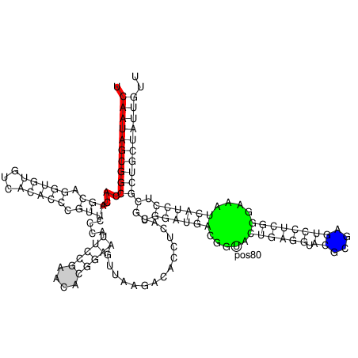

=======================
The Program ``RNAplot``
=======================

.. contents:: Table of Contents
    :depth: 1
    :local:

Introduction
============

You can manually add additional annotation to structure drawings using the ``RNAplot``
program (for information see its ``man`` page). Here's a somewhat complicated example:

.. code::

  $ RNAfold 5S.seq > 5S.fold
  $ RNAplot --pre "76 107 82 102 GREEN BFmark 44 49 0.8 0.8 0.8 Fomark \
    1 15 8 RED omark 80 cmark 80 -0.23 -1.2 (pos80) Label 90 95 BLUE Fomark" < 5S.fold
  $ gv 5S_ss.ps

PostScript macros
=================

``RNAplot`` is a very useful tool to color structure layout plots. The ``--pre`` tag adds
PostScript code required to color distinct regions of your molecule. There are some predefined 
statements with different options for annotations listed below:

========================= =============================================================
Command                   Description
========================= =============================================================
``i cmark``               draws circle around base i
``i j c gmark``           draw basepair i,j with c counter examples in grey
``i j lw rgb omark``      stroke segment i...j with linewidth lw and color (rgb)
``i j rgb Fomark``        fill segment i...j with color (rgb)
``i j k l rgb BFmark``    fill block between pairs i,j and k,l with color (rgb)
``i dx dy (text) Label``  adds a textlabel with an offset dx and dy relative to base i
========================= =============================================================

Predefined color options are ``BLACK, RED, GREEN, BLUE, WHITE`` but you can also 
replace the value to some standard RGB code (e.g. 0 5 8 for lightblue).

To simply add the annotation macros to the ``PostScript`` file without
any actual annotation you can use the following program call

.. code:: bash

  $ RNAplot --pre "" < 5S.fold

If you now open the structure layout file ``5S_ss.ps`` with a text editor you'll see
the additional macros for ``cmark``, ``omark``, etc. along with some show synopsis
on how to use them. Actual annotations can then be added between the lines::

  % Start Annotations

and::

  % End Annotations

Here, you simply need to add the same string of commands you would provide through the
``--pre`` option of ``RNAplot``.
