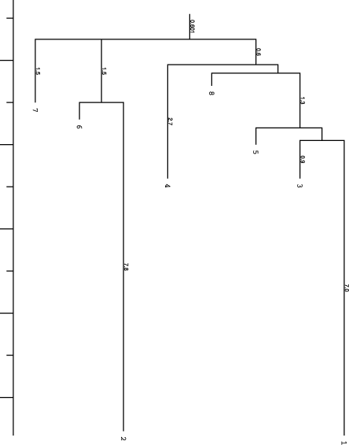
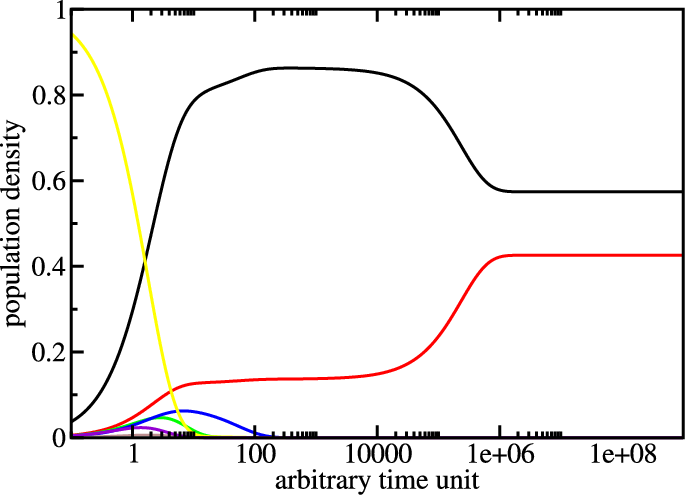
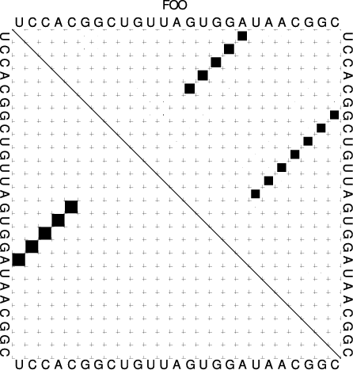

=========================================
The Programs ``barriers`` and ``treekin``
=========================================

.. contents:: Table of Contents
    :maxdepth: 1
    :local:

Introduction
============

The following assumes you already have the ``barriers`` and ``treekin``
programs installed. They are **not** part of the ``ViennaRNA Package``
but their latest releases can be found at
https://www.tbi.univie.ac.at/RNA/Barriers/ and
https://www.tbi.univie.ac.at/RNA/Treekin/, respectively.
Installation proceeds as shown for the ``ViennaRNA Package``.

.. note::

  One problem that often occurs during ``treekin`` installation is the
  dependency on ``blas`` and ``lapack`` packages. For further information
  according to the ``barriers`` and ``treekin`` program also see the website.

A short recall on howto install/compile a program
=================================================

- Get the barriers source from https://www.tbi.univie.ac.at/RNA/Barriers/

- extract the archive and go to the directory::

    $ tar -xzf Barriers-1.5.2.tar.gz
    $ cd Barriers-1.5.2

- use the ``--prefix`` option to install in your ``Progs/`` directory::

    $ ./configure --prefix=$HOME/Tutorial/Progs/barriers-1.5.2

- make install::

    $ make
    $ make install

Now ``barriers`` is ready to use. Apply the same steps to install ``treekin``.

.. note::

  Copy the ``barriers`` and ``treekin`` binaries to your ``bin`` folder
  or add the path to your ``PATH`` environment variable.

Calculate the Barrier Tree
==========================

.. code::

  $ echo UCCACGGCUGUUAGUGGAUAACGGC | RNAsubopt --noLP -s -e 10 > barseq.sub
  $ barriers -G RNA-noLP --bsize --rates < barseq.sub > barseq.bar

You can restrict the number of local minima using the ``barriers``
command-line option ``--max`` followed by a number. The option ``-G RNA-noLP``
instructs barriers that the input consists of RNA secondary structures without
isolated basepairs. ``--bsize`` adds size of the gradient basins and ``--rates``
tells ``barriers`` to compute rates between macro states/basins for use with
``treekin``. Another useful options is ``--minh`` to print only minima with
a barrier :math:`> dE`. Look at the output file ``barseq.bar``, its content
should be like::

    UCCACGGCUGUUAGUGGAUAACGGC
  1 (((((........))))).......  -6.90    0  10.00    115     0  -7.354207     23  -7.012023
  2 ......(((((((.....)))))))  -6.80    1   9.30     32    58  -6.828221     38  -6.828218
  3 (((...(((...)))))).......  -0.80    1   0.90      1    10  -0.800000      9  -1.075516
  4 ....((..((((....)))).))..  -0.80    1   2.70      5    37  -0.973593     11  -0.996226
  5 .........................   0.00    1   0.40      1    14  -0.000000     26  -0.612908
  6 ......(((....((.....)))))   0.60    2   0.40      1    22   0.600000      3   0.573278
  7 ......((((((....)))...)))   1.00    1   1.50      1    95   1.000000      2   0.948187
  8 .((....((......)).....)).   1.40    1   0.30      1    30   1.400000      2   1.228342

The first row holds the input sequence, the successive list the local
minima ascending in energy. The meaning of the first 5 columns is as follows

- label (number) of the local minima (1=MFE)
- structure of the minimum
- free energy of the minimum
- label of deeper local minimum the current minimum merges with (note that the
  ``MFE`` has no deeper local minimum to merge with)
- height of the energy barrier to the local minimum to merge with
- numbers of structures in the basin we merge with
- number of basin which we merge to
- free energy of the basin
- number of structures in this basin using gradient walk
- gradient basin (consisting of all structures where gradientwalk ends in the minimum)

``barriers`` produced two additional files, the *PostScript* file ``tree.eps``
which represents the basic information of the ``barseq.bar`` file visually:

and a text file ``rates.out`` which holds the matrix of transition probabilities
between the local minima.

Simulating the Folding Kinetics
===============================

The program ``treekin`` is used to simulate the evolution over time of the
population densities of local minima starting from an initial population
density distribution :math:`p0` (given on the command-line) and the transition
rate matrix in the file ``rates.out``.

.. code::

  $ treekin -m I --p0 5=1 < barseq.bar | xmgrace -log x -nxy -

|kin| |dot|

The simulation starts with all the population density in the open chain
(local minimum 5, see ``barseq.bar``). Over time the population density of
this state decays (yellow curve) and other local minima get populated.
The simulation ends with the population densities of the thermodynamic
equilibrium in which the MFE (black curve) and local minimum 2 (red curve)
are the only ones populated. (Look at the dot plot of the sequence created
with ``RNAsubopt`` and ``RNAfold``!)
