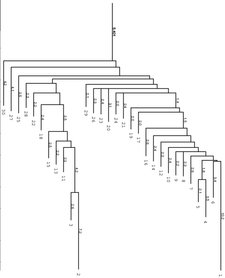
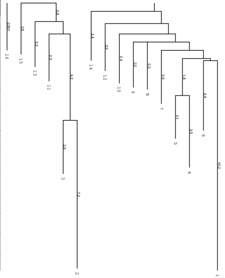
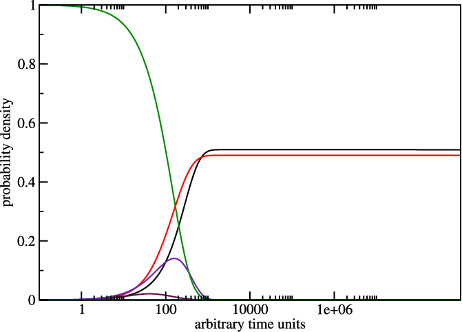

=========================
The Program ``switch.pl``
=========================

.. contents:: Table of Contents
    :maxdepth: 1
    :local:

Introduction
============

The ``switch.pl`` script can be used to design bi-stable structures, i.e.
structures with two almost equally good foldings. For two given structures
there are always a lot of sequences compatible with both structures. If both 
structures are reasonably stable you can find sequences where both target 
structures have almost equal energy and all other structures have much higher
energies.
Combined with ``RNAsubopt``, ``barriers`` and ``treekin``, this is a very
useful tool for designing RNA switches.

The input requires two structures in dot-bracket notation and additionally
you can add a sequence. It is also possible to calculate the switching
function at two different temperatures with option ``-T`` and ``-T2``.

Designing a Switch
==================

Now we try to create an RNA switch using ``switch.pl`` :cite:p:`flamm:2001`.
First we create our inputfile, then invoke the program using ten optimization
runs  (``-n 10``) and do not allow *lonely pairs*. Write it out to ``switch.out``

.. code::

  $ cat > switch.in
  ((((((((......))))))))....((((((((.......))))))))
  ((((((((((((((((((........)))))))))))))))))).....

  $ switch.pl -n 10 --noLP < switch.in > switch.out

``switch.out`` should look similar like this, the first block represents our
bi-stable structures in random order, the second block shows the resulting
sequences ordered by their score.

.. code::

  $ cat switch.out
  GGGUGGACGUUUCGGUCCAUCCUUACGGACUGGGGCGUUUACCUAGUCC   0.9656
  CAUUUGGCUUGUGUGUCGAAUGGCCCCGGUACGUAGGCUAAAUGUACCG   1.2319
  GGGGGGUGCGUUCACACCCCUCAUUUGGUGUGGAUGUGCUUUCUACACU   1.1554
  [...]

the resulting sequences are::

  CAUUUGGCUUGUGUGUCGAAUGGCCCCGGUACGUAGGCUAAAUGUACCG   1.2319
  GGGGGGUGCGUUCACACCCCUCAUUUGGUGUGGAUGUGCUUUCUACACU   1.1554
  CGGGUUGUAACUGGAUAGCCUGGAAACUGUUUGGUUGUAAUCCGAACAG   1.0956
  [...]

Given all 10 suggestions in our ``switch.out``, we select the one with the
best score with some command line tools to use it as an ``RNAsubopt`` input
file and build up the barriers tree.

.. code::

  $ tail -10 switch.out | awk '{print($1)}'  | head -n 1 > subopt.in
  $ RNAsubopt --noLP -s -e 25 < subopt.in > subopt.out
  $ barriers -G RNA-noLP --bsize --rates --minh 2 --max 30 < subopt.out > barriers.out

``tail -10`` cuts the last 10 lines from the ``switch.out`` file and pipes
them into an ``awk`` script. The function ``print($1)`` echoes only the first
column and this is piped into the ``head`` program where the first line, which 
equals the best scored sequence, is taken and written into ``subopt.in``.
Then ``RNAsubopt`` is called to process our sequence and write the output to
another file which is the input for the barriers calculation.

Below you find an example of the barrier tree calculation above done with the
right settings (connected root) on the left side and the wrong ``RNAsubobt -e``
value on the right. Keep in mind that ``switch.pl`` performs a stochastic search
and the output sequences are different every time because there are a lot of
sequences which fit the structure and switch calculates a new one everytime.
Simply try to make sure.

|bt1| |bt2|

left: Barriers tree as it should look like, all branches connected to the main root
right: disconnected tree due to a too low energy range (``-e``) parameter set in
``RNAsubopt``.

Be careful to set the range ``-e`` high enough, otherwise we get a problem when
calculation the kinetics using ``treekin``. Every branch should be somehow connected
to the main root of the tree. Try ``-e 20`` and ``-e 30`` to see the difference in
the trees and choose the optimal value. By using ``--max 30`` we shorten our tree
to focus only on the lowest minima.

We then select a branch preferably outside of the two main branches, here branch
30 (may differ from your own calculation). Look at the barrier tree to find the
best branch to start and replace ``30`` by the branch you would choose. Now use
``treekin`` to plot concentration kinetics and think about the graph you just
created.

.. code::

  $ treekin -m I --p0 30=1  < barriers.out > treekin.out
  $ xmgrace -log x -nxy treekin.out

The graph could look like the one below, remember everytime you use ``switch.pl``
it can give you different sequences so the output varies too. Here the one from
the example.

